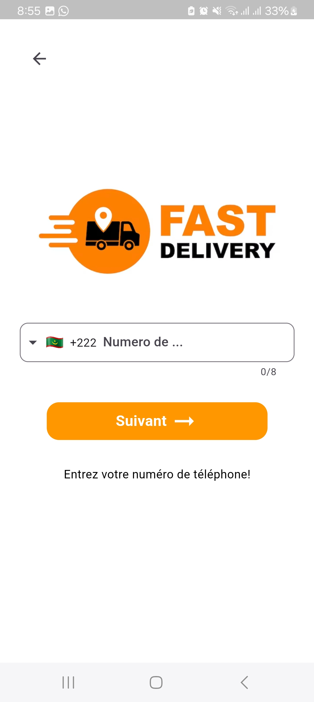
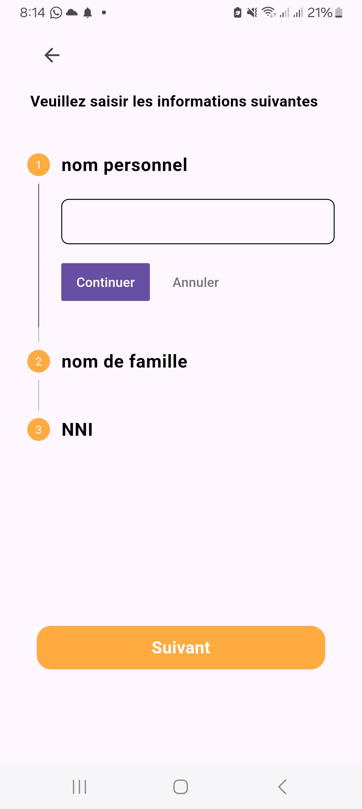
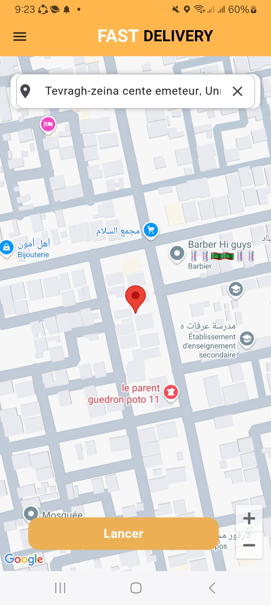
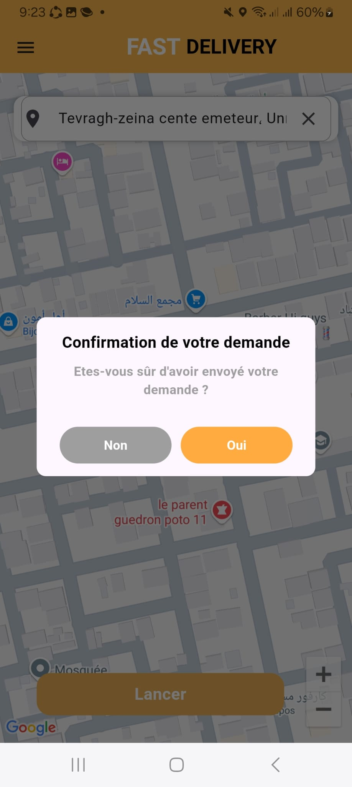
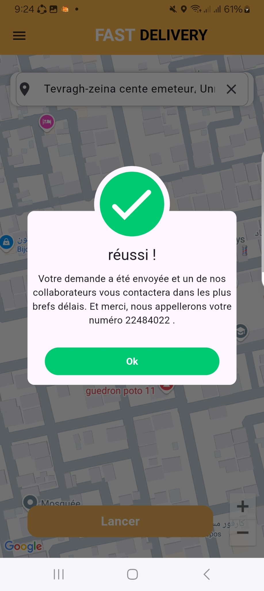
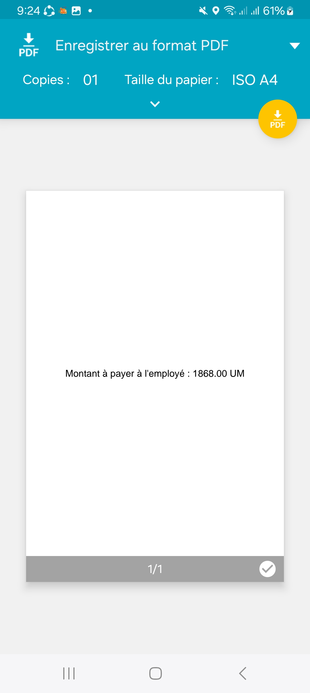

# Description
Fast Delivery est une application mobile développée avec Flutter permettant aux utilisateurs d’envoyer des colis rapidement et efficacement.
L’utilisateur peut créer une demande de livraison en indiquant sa position actuelle ainsi que la destination du colis. Le système calcule automatiquement le coût et notifie les livreurs disponibles à proximité.

# Contexte
Projet réalisé dans le cadre de mon stage en développement informatique, avec pour objectif de concevoir un système complet de gestion de livraison.

# Fonctionnalités
- Authentification par numéro de téléphone (SMS)
- Gestion du profil utilisateur (nom, prénom, email)
- Détection automatique de la position actuelle
- Création d’une demande de livraison
- Sélection de la destination du colis
- Génération automatique du prix
-  Génération d’un reçu PDF
-  Notification des livreurs à proximité

# Technologie
- Flutter (Frontend mobile)
- Spring Boot (Backend)
-  MySQL (Base de données)
-  Firebase Cloud Messaging (Notifications)
-  Postman (Tests API)

## Captures d'écran

  <b>1- Page d'accueil</b> 
  

  <b>2- Authentification (numéro de téléphone)</b> 
  

  <b>3️- Informations personnelles</b> 
  

  <b>4️- Choisir la destination du colis</b> 
  

  <b>5️- Confirmation de la demande</b> 
  

  <b>6️- Demande envoyée</b> 
  

  <b>7️- Montant à payer (PDF)</b> 
  

## Installation
1- Cloner le repository :
 git clone https://github.com/Mohamedissa282/Fast-Delivery.git
- **cd Fast-Delivery**
 
2- Installer les dépendances
- **flutter pub get**
 
3- Lancer l’application
- **flutter run**
 
# Explications
- **git clone** → récupère le projet depuis GitHub  
- **flutter pub get** → installe toutes les dépendances nécessaires pour Flutter  
- **flutter run** → lance l’application sur ton émulateur ou téléphone  
 
